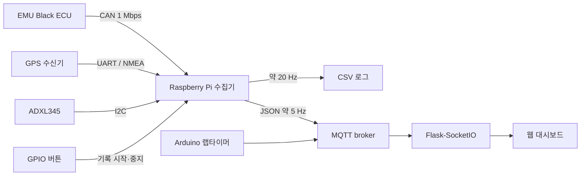

# EMU LOGGER

EMU Black ECU의 CAN 텔레메트리와 GPS·가속도 데이터를 Raspberry Pi에서 수집하는 차량 데이터 로거입니다. 수집한 데이터를 CSV로 저장하고 MQTT와 Flask-SocketIO를 통해 웹 대시보드로 전달합니다.

- SocketCAN 기반 EMU CAN 프레임 수신 및 물리량 변환
- UART GPS와 I²C ADXL345 데이터 수집
- CAN·GPS·가속도 값을 하나의 스냅샷으로 병합
- 약 20 Hz CSV 기록 및 약 5 Hz MQTT 발행
- GPIO 버튼과 LED를 이용한 현장 로깅 제어
- 차량 계기, 센서, GPS, 가속도 웹 화면 제공
- PCB 제작 자료와 Arduino 광센서 랩타이머 코드 포함

## 시스템 구성

| 구성 요소 | 인터페이스 및 설정 |
| --- | --- |
| EMU Black ECU | SocketCAN `can0`, 1 Mbps |
| GPS 수신기 | UART `/dev/serial0`, 9,600 baud |
| ADXL345 | I²C bus 1, address `0x53` |
| 로깅 버튼 | BCM GPIO 17 |
| 상태 LED | BCM GPIO 27, 22, 5 |
| 원격 전송 | MQTT `car/emu/telemetry` |
| 웹 서버 | Flask, Flask-SocketIO, port 5000 |

### 소프트웨어 스택

| 영역 | 기술 |
| --- | --- |
| 차량 통신 | Linux SocketCAN, python-can |
| 센서 입력 | pyserial, pynmea2, smbus2 |
| 로컬 제어 | RPi.GPIO |
| 데이터 저장 | Python CSV |
| 메시지 전송 | MQTT, paho-mqtt |
| 웹 서버 | Flask, Flask-SocketIO |
| 대시보드 | HTML, JavaScript, Socket.IO, Chart.js, Leaflet |

## 데이터 흐름



각 입력 worker는 최신 값을 `can`, `gps`, `accel` 영역에 저장합니다.

```json
{
  "timestamp": "YYYY-MM-DD HH:MM:SS.mmm",
  "can": {},
  "gps": {},
  "accel": {}
}
```

CSV와 MQTT 메시지는 이 최신 값들을 병합해 생성합니다. 각 센서의 취득 주기가 다르므로 한 행의 값이 모두 같은 시각에 측정된 것은 아닙니다.

## CAN 데이터 처리

[`raspi/can_worker.py`](raspi/can_worker.py)는 EMU Black의 `0x600`부터 `0x607` 프레임을 처리합니다.

- RPM, TPS, 차량 속도, 기어
- 흡기·냉각수·오일·ECU 온도
- MAP, 오일·연료 압력
- Lambda, 점화각, 배터리 전압
- DBW 위치·목표와 traction-control 관련 값

다중 바이트 값은 프레임별 endian, signed 여부와 scale을 적용해 물리량으로 변환합니다. 사용자 정의 `0x500` 프레임과 랩 카운트를 전송하는 `0x700` 경로도 포함합니다.

## GPS·가속도 처리

### GPS

- NMEA RMC/GGA 문장 파싱
- 위도, 경도, 속도, 방위, 고도, 위성 수 추출
- knot 단위 속도를 km/h로 변환
- UBX `CFG-RATE` 명령으로 10 Hz 측정 주기 요청

### ADXL345

- X/Y/Z 6바이트 데이터를 signed 16-bit 값으로 변환
- `0.0156 g/LSB` 적용
- `ax_g`, `ay_g`, `az_g` 출력

축 순서와 부호 변환은 실제 센서 장착 방향에 맞는지 차량에서 확인해야 합니다.

## CSV·MQTT·대시보드

`raspi/main.py`은 `/home/pi/logs/datalog_YYYYMMDD_HHMMSS.csv`를 생성하고 약 0.05초 간격으로 기록합니다. GPIO 17 버튼으로 기록을 중지하거나 새 파일로 다시 시작합니다.

기본 MQTT 설정은 다음과 같습니다.

```text
Broker: test.mosquitto.org
Port: 1883
Topic: car/emu/telemetry
Publish interval: 0.2 s
```

웹 서버는 MQTT 메시지를 받아 다음 Socket.IO 이벤트로 전달합니다.

| 이벤트 | 내용 |
| --- | --- |
| `telemetry_update` | CAN, GPS, 가속도 텔레메트리 |
| `lap_time_update` | Arduino 랩타이머 메시지 |

## 실행

### 웹 서버

```bash
python3 -m venv .venv
source .venv/bin/activate
python3 -m pip install -r web_server/requirements.txt
python3 web_server/telemetry_server.py
```

기본 접속 주소:

```text
http://<server-address>:5000/
```

### Raspberry Pi 수집기

코드가 의도하는 실행 형태는 다음과 같습니다.

```bash
sudo python3 -m raspi.main
```

필요 패키지:

```text
python-can pyserial pynmea2 paho-mqtt RPi.GPIO smbus2
```

## 저장소 구조

```text
EMU-LOGGER/
├── PCB/             # 회로도, PCB JSON, Gerber
├── laptimer/        # Arduino 광센서 랩타이머
├── raspi/           # CAN·GPS·가속도 수집기
└── web_server/      # MQTT 중계 및 웹 대시보드
```

## 현재 제한사항

- `raspi/gps_worker.py`에 비-Python 출력이 포함되어 현재 상태로 import할 수 없습니다.
- `raspi/main.py`이 참조하는 `wifi_monitor.py`가 저장소에 없습니다.
- 수집기용 `requirements.txt`와 자동화된 하드웨어 통합 테스트가 없습니다.
- CSV와 MQTT는 센서별 최신 값을 병합하므로 측정 시각이 완전히 일치하지 않습니다.
- 공개 MQTT broker는 인증과 TLS를 사용하지 않습니다. 실제 차량에서는 전용 broker, TLS, 계정 인증과 토픽 ACL이 필요합니다.
- CAN 송신과 DRS 모터 제어 코드는 벤치에서 ID, payload, 방향과 fail-safe를 검증한 뒤 차량에 연결해야 합니다.
