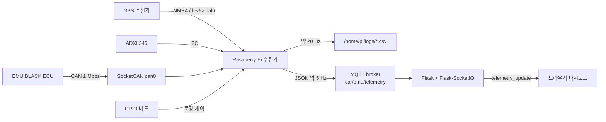

# EMU LOGGER

Raspberry Pi에서 차량 ECU의 CAN 텔레메트리와 GPS·가속도 데이터를 함께 수집해 CSV로 기록하고, MQTT와 웹 대시보드로 전달하는 모터스포츠 데이터 로거입니다.

## 제작 배경

서킷 주행 데이터를 돌아보려면 엔진 회전수나 스로틀 개도량 같은 ECU 정보만으로는 부족합니다. 차량이 트랙의 어느 지점에 있었는지, 어떤 속도와 가속도 상태였는지를 같은 시간축에서 확인할 수 있어야 주행 상황을 입체적으로 해석할 수 있습니다.

EMU LOGGER는 EMU BLACK ECU를 사용하는 차량을 대상으로 다음 문제를 하나의 수집 파이프라인으로 해결하고자 시작했습니다.

- 서로 다른 인터페이스로 들어오는 CAN, GPS, 가속도 데이터를 한곳에 모으기
- 현장에서 별도 조작을 최소화하면서 주행 데이터를 파일로 남기기
- 차량 밖에서도 현재 텔레메트리를 확인할 수 있도록 네트워크로 전달하기
- 원시 데이터 수집과 화면 표시를 분리해 각 부분을 독립적으로 확장하기

## 목표

- EMU CAN 프레임을 실제 물리량으로 변환한다.
- GPS 위치·속도와 3축 가속도를 차량 데이터와 함께 기록한다.
- 수집기의 최신 상태를 일정한 형식의 CSV와 JSON으로 제공한다.
- MQTT를 경계로 Raspberry Pi 수집기와 Flask 웹 서버를 분리한다.
- 브라우저에서 차량 계기, GPS, 가속도 정보를 실시간으로 확인한다.

## 전체 시스템과 데이터 흐름



수집기는 각 입력 worker가 갱신한 최신 값을 `can`, `gps`, `accel` 영역으로 합칩니다. 같은 스냅샷을 로컬에서는 CSV 행으로 저장하고, 네트워크에서는 `timestamp`, `can`, `gps`, `accel` 구조의 JSON으로 발행합니다.

## 개발 과정

### 1. CAN 데이터 수집

먼저 Linux SocketCAN의 `can0` 인터페이스를 1 Mbps로 설정하고, EMU BLACK ECU가 보내는 `0x600`부터 `0x607`까지의 8개 프레임을 구분해 읽도록 구성했습니다. [`raspi/can_worker.py`](raspi/can_worker.py)의 프레임별 파서는 바이트 배열의 엔디언과 배율을 반영해 RPM, TPS, 흡기·냉각수·오일 온도, 압력, 람다, 기어, 배터리 전압 등의 값으로 변환합니다. 별도의 `0x500` 프레임에서는 추가 온도 값도 읽습니다.

수신과 파싱을 `CanWorker`에 모으고, 파싱 결과만 콜백으로 전달하게 해 메인 루프가 CAN 프레임의 세부 형식에 의존하지 않도록 했습니다. 동일 worker의 송신 경로는 랩 카운트를 CAN ID `0x700`으로 전달하는 데 사용합니다.

### 2. GPS·가속도 통합

GPS는 `/dev/serial0`, 9,600 baud에서 NMEA RMC/GGA 문장을 읽어 위도·경도, 속도, 방위, 고도, 위성 수와 fix 상태로 변환하도록 설계했습니다. 가속도는 I²C 버스 1의 ADXL345(`0x53`)에서 X/Y/Z 축을 읽고 `ax_g`, `ay_g`, `az_g`로 변환합니다. 관련 구현은 [`raspi/gps_worker.py`](raspi/gps_worker.py)와 [`raspi/accel_worker.py`](raspi/accel_worker.py)에서 확인할 수 있습니다.

각 장치는 입력 주기와 실패 조건이 다르므로 독립 worker와 스레드로 실행합니다. 콜백은 `latest_can_data`, `latest_gps_data`, `latest_acc_data`를 갱신하고, 저장과 전송 단계는 이 최신 상태를 조합합니다.

### 3. CSV 저장

[`raspi/main.py`](raspi/main.py)은 실행 시 `/home/pi/logs/datalog_YYYYMMDD_HHMMSS.csv` 파일을 만들고 약 20 Hz 주기로 최신 CAN·GPS·가속도 값을 한 행에 기록합니다. BCM GPIO 17 버튼으로 기록을 중지하거나 다시 시작하고, GPIO 27 LED로 로깅 상태를 표시합니다. 파일 열기·헤더 작성·행 병합·종료 시 파일 닫기까지 수집기 프로세스가 관리합니다.

### 4. MQTT 전송

로컬 파일 기록과 원격 모니터링의 주기를 분리했습니다. [`raspi/mqtt_client.py`](raspi/mqtt_client.py)가 MQTT 연결과 네트워크 루프를 담당하고, 메인 수집기는 약 5 Hz마다 통합 JSON을 `car/emu/telemetry` 토픽으로 발행합니다. MQTT 연결이 없을 때는 로컬 수집 루프를 막지 않고 발행을 건너뛰도록 구성했습니다.

### 5. Flask-SocketIO 대시보드

[`web_server/telemetry_server.py`](web_server/telemetry_server.py)는 MQTT 텔레메트리 토픽을 구독한 뒤 수신 JSON을 Socket.IO의 `telemetry_update` 이벤트로 브라우저에 중계합니다. 마지막 메시지를 메모리에 보관해 새로 접속한 클라이언트에도 현재 상태를 전달하며, `/api/submit`을 통한 JSON 입력도 같은 이벤트 흐름에 연결했습니다.

[`web_server/dashboard/`](web_server/dashboard/)에는 차량 계기와 주요 센서, GPS 지도, 3축 가속도 화면이 나뉘어 있습니다. 랩타이머 데이터는 `lap_time_update` 이벤트로 별도 처리합니다.

## 핵심 구현과 설계 판단

| 판단 | 구현 | 이유 |
| --- | --- | --- |
| 입력 장치별 worker 분리 | CAN은 `recv_once`, GPS·가속도는 `read_once` 인터페이스로 반복 실행 | 장치별 초기화와 오류 처리를 격리하고 메인 흐름을 단순하게 유지하기 위해 |
| 최신 상태 스냅샷 사용 | 각 콜백이 소스별 딕셔너리를 갱신하고 저장 시 병합 | 서로 다른 입력 주기를 하나의 CSV/JSON 구조로 묶기 위해 |
| 로컬 저장과 원격 전송 분리 | CSV 약 20 Hz, MQTT 약 5 Hz | 원본에 가까운 기록 밀도와 네트워크 사용량을 각각 조절하기 위해 |
| MQTT를 시스템 경계로 사용 | 수집기는 발행, 웹 서버는 구독 | 차량 하드웨어 의존 코드와 사용자 화면을 독립적으로 실행하기 위해 |
| 현장 조작을 GPIO로 제공 | 버튼으로 로깅 전환, LED로 기록·오류·Wi-Fi 상태 표현 | 모니터와 키보드 없이 수집 상태를 확인하고 제어하기 위해 |
| 종료 이벤트 공유 | 신호 수신 시 worker, MQTT, 파일, GPIO를 순서대로 정리 | 여러 스레드와 하드웨어 자원을 한 종료 흐름에서 관리하기 위해 |

## 저장소 구조

```text
EMU-LOGGER/
├── PCB/                    # 데이터 로거 PCB 자료와 Gerber
├── laptimer/               # Arduino 랩타이머 코드
├── raspi/                  # Raspberry Pi 수집기와 하드웨어 worker
│   ├── main.py
│   ├── can_worker.py
│   ├── gps_worker.py
│   ├── accel_worker.py
│   ├── gpio_ctl.py
│   ├── mqtt_client.py
│   └── config.py
├── web_server/             # Flask-SocketIO 서버와 대시보드
│   ├── telemetry_server.py
│   ├── config.py
│   ├── requirements.txt
│   ├── dashboard/
│   └── static/
└── README.md
```

주요 모듈은 다음과 같습니다.

| 영역 | 모듈 |
| --- | --- |
| 수집 오케스트레이션, CSV, MQTT, GPIO | [`raspi/main.py`](raspi/main.py) |
| SocketCAN 설정과 EMU 프레임 파싱 | [`raspi/can_worker.py`](raspi/can_worker.py) |
| NMEA GPS 파싱 | [`raspi/gps_worker.py`](raspi/gps_worker.py) |
| ADXL345 초기화와 3축 변환 | [`raspi/accel_worker.py`](raspi/accel_worker.py) |
| 버튼과 상태 LED | [`raspi/gpio_ctl.py`](raspi/gpio_ctl.py) |
| 수집기 MQTT 클라이언트 | [`raspi/mqtt_client.py`](raspi/mqtt_client.py) |
| 장치·토픽 설정 | [`raspi/config.py`](raspi/config.py) |
| MQTT/HTTP/Socket.IO 중계 | [`web_server/telemetry_server.py`](web_server/telemetry_server.py) |
| 차량·GPS·가속도 화면 | [`web_server/dashboard/`](web_server/dashboard/) |
| PCB 자료 | [`PCB/README.md`](PCB/README.md) |
| Arduino 랩타이머 | [`laptimer/lapTimer.ino`](laptimer/lapTimer.ino) |

## 실행 안내

### 준비 환경

- Linux SocketCAN과 GPIO/I²C/UART를 사용할 수 있는 Raspberry Pi
- `can0`에 연결된 EMU BLACK ECU
- `/dev/serial0`에 연결된 9,600 baud NMEA GPS
- I²C 버스 1, 주소 `0x53`의 ADXL345
- BCM GPIO 17(버튼), 27(로깅 LED), 22(오류 LED), 5(Wi-Fi LED)
- Python 3와 `python-can`, `pyserial`, `pynmea2`, `paho-mqtt`, `RPi.GPIO`, `smbus2` 계열 패키지

웹 서버 의존성은 저장소에 포함된 목록으로 설치할 수 있습니다.

```bash
python3 -m venv .venv
source .venv/bin/activate
python3 -m pip install -r web_server/requirements.txt
python3 web_server/telemetry_server.py
```

웹 서버는 기본적으로 `0.0.0.0:5000`에서 실행됩니다. Raspberry Pi 수집기는 패키지 상대 import를 사용하므로 저장소 루트에서 다음 형태로 실행하도록 구성되어 있습니다.

```bash
sudo python3 -m raspi.main
```

수집기용 `requirements.txt`와 서비스 자동 시작 설정은 아직 저장소에 포함되어 있지 않습니다. 아래 현재 상태의 코드 이슈도 먼저 정리해야 전체 수집기를 실행할 수 있습니다.

## 개발하며 배운 점

- 센서 통합에서는 모든 입력을 같은 주기로 강제하기보다, 소스별 수집과 공통 스냅샷 생성을 분리하는 편이 구조를 단순하게 만든다는 점을 확인했습니다.
- CAN 바이트를 물리량으로 바꾸는 과정에서는 엔디언, signed 여부, 배율이 곧 데이터 의미이므로 프레임별 파서를 명시적으로 유지하는 것이 중요했습니다.
- 현장용 로거는 데이터 처리뿐 아니라 버튼 디바운스, 상태 LED, 종료 시 파일과 장치 정리처럼 운영 흐름도 함께 설계해야 했습니다.
- MQTT와 Socket.IO를 연결해 수집기와 화면을 분리하면, 차량 쪽 하드웨어 코드와 모니터링 UI를 서로 다른 환경에서 발전시킬 수 있습니다.
- CSV와 실시간 화면은 목적이 다르므로 기록 주기와 전송 주기를 독립적으로 다루는 편이 적합했습니다.

## 현재 상태와 다음 개선 방향

저장소에는 CAN 프레임 파서, ADXL345 worker, CSV·MQTT 오케스트레이션, Flask-SocketIO 중계와 대시보드가 구현되어 있습니다. 다만 현재 체크아웃의 [`raspi/gps_worker.py`](raspi/gps_worker.py)는 수집기 코드가 중복 합쳐진 상태여서 `SyntaxError`가 발생하며, [`raspi/main.py`](raspi/main.py)이 import하는 `raspi/wifi_monitor.py`도 추적되어 있지 않습니다. 따라서 Raspberry Pi 수집기의 전체 실행은 이 두 항목을 정리한 뒤 진행해야 합니다.

다음 개선 방향은 다음과 같습니다.

- GPS worker를 독립 모듈로 복원하고 Wi-Fi 모니터 구현과 import 경로 정리
- 수집기 의존성 목록과 systemd 실행 설정 추가
- 실제 CAN·GPS·I²C 장치가 연결된 환경에서 통합 동작 점검
- 센서별 수집 시각을 함께 기록해 서로 다른 샘플 주기의 시간 정합성 개선
- MQTT 재연결, 로컬 버퍼링과 장기 저장 정책 보강
- 설정값을 환경 변수나 별도 배포 설정으로 분리

## 운영 보안 주의

현재 설정은 인증과 TLS가 없는 공개 개발용 broker `test.mosquitto.org:1883`을 사용합니다. 실제 차량이나 공개 시연 환경에서는 전용 broker, TLS, 계정 인증과 토픽 ACL을 적용하고, Flask 서버와 `/api/submit`에도 인증·입력 검증·요청 제한을 추가해야 합니다. 차량 위치와 주행 데이터가 외부에 노출되지 않도록 운영 설정과 비밀값은 소스 코드 밖에서 관리해야 합니다.
